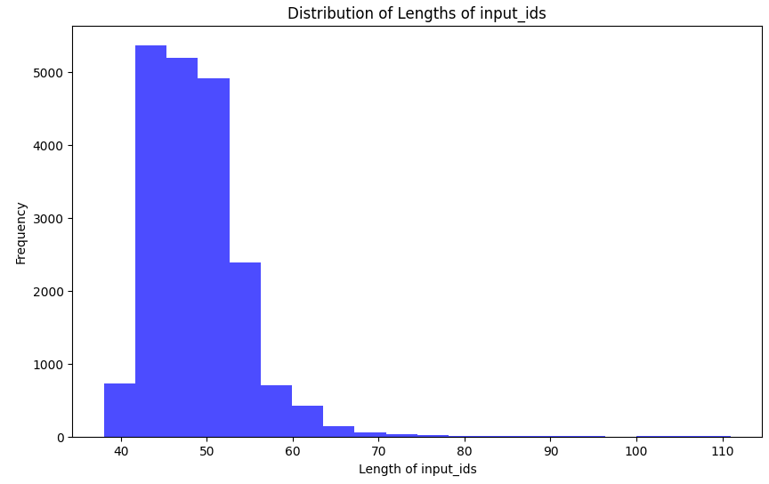

<a name="readme-top"></a>

<div align="center">
  <a href="https://https://github.com/dbpprt/LeanLLM-X">
    
  </a>
</div>

# [LlamaMaker](https://github.com/dbpprt/LlamaMaker)

[![Contributors][contributors-shield]][contributors-url]
[![Forks][forks-shield]][forks-url]
[![Stargazers][stars-shield]][stars-url]
[![Issues][issues-shield]][issues-url]
[![MIT License][license-shield]][license-url]
[![LinkedIn][linkedin-shield]][linkedin-url]

### Build, Train, and Fine-tune Large Language Models on [Amazon SageMaker](https://aws.amazon.com/sagemaker/) 🚀

Welcome to the **LlamaMaker** repository, a easy to use solution to build and fine-tune *Large Language Models* unlocking the power of [Gen AI](https://aws.amazon.com/generative-ai/). Harness the capabilities of [AWS Trainium](https://aws.amazon.com/machine-learning/trainium/) (soon), [AWS Inferentia](https://aws.amazon.com/machine-learning/inferentia/) (soon) and [NVIDIA GPUs](https://aws.amazon.com/nvidia/) to scale your fine-tuning with ease.

This solution provides you an easy to use abstraction layer to fine-tune custom Llama variants locally or remotely using SageMaker training jobs. We support distributed training on **g5.**, **p4d**, and **p5** instances. LlamaMaker streams **Tensorboard** results back and allows you to easily scale your training jobs .


> **Note**: LlamaMaker is actively being developed. To see what features are in progress, please check out the [issues](https://github.com/dbpprt/LlamaMaker/issues) section of our repository.

## 🏗️ Architecture
- LamaMaker is built on top of [🤗 transformers](), [🤗 peft](), [🤗 trl](), [🤗 accelerate]() and integrates with the SageMaker SDK.
- Custom training container images with automated build pipeline (based on GitHub Action, hosted in AWS CodeBuild)
- Local first: LlamaMaker is designed to run locally on Apple Silicon, providing a first class experience for developers.

## 🌟 Features
- 🎯 **BYOC** - Custom container support with integrated deployment and build pipeline.
- 🎯 **BYOD** - Bring your own datasets, models or both *without writing any code*.
- 🎯 Supported models: **Llama-8B**, **Llama-70B** *(coming soon)*, **Mistral-7B** *(coming soon)*
- 🎯 Local first: LlamaMaker is designed to run locally on Apple Silicon, providing a first class experience for developers. (MPS backend)
- 🎯 Support for **fp32**, **fp16**, **fp8**, **QLoRa**, **LoRa** and more.
- 🎯 Tensorboard integration to monitor training progress..
- 🎯 [smdistributed](https://docs.aws.amazon.com/sagemaker/latest/dg/data-parallel-modify-sdp-pt.html) on **p4d.***
- 🎯 **Single-node multi-GPU** fully supported
- 🎯 Extensive validation metrics for JSON generation (schema validation, field based accuracy, and more)
- 🎯 Automatic S3 code upload (respecting your .gitignore).
- 🎯 *coming soon*: Support for [Automatic Model Tuning](https://docs.aws.amazon.com/sagemaker/latest/dg/automatic-model-tuning.html)
- 🎯 *coming soon*: **Multi-node multi-gpu**
- 🎯 *coming soon*: **FSDP**, **DeepSpeed**

## 🏃‍♀️Getting Started

### Setup your development environment

<!-- ```bash
# make sure to have a local conda environment, otherwise
# TODO: pathes are likely not working, due to folder restructuring
chmod +x scripts/development-environment/environment.sh
sh scripts/development-environment/environment.sh
``` -->

```bash
conda env create -f scripts/development-environment/environment.yaml
conda activate llamamaker
```

### Fine-tune locally using [TinyLlama/TinyLlama-1.1B-intermediate-step-1431k-3T](https://huggingface.co/TinyLlama/TinyLlama-1.1B-intermediate-step-1431k-3T) with the [MPS backend](https://pytorch.org/docs/stable/notes/mps.html)
```bash
# note: this only works on Apple Silicon and is intended for debugging purposes!
accelerate launch --config_file=./config/local.yaml \
                    train.py \
                    --model_id TinyLlama/TinyLlama-1.1B-intermediate-step-1431k-3T \
                    --data_config ./data/swisstext2023/llama3.yaml \
                    --debug \
                    --per_device_train_batch_size 1 \
                    --per_device_eval_batch_size 1 \
                    --gradient_accumulation_steps 1 \
                    --max_seq_length 256 \
                    --logging_steps 1 \
                    --eval_steps 5 \
                    --save_steps 50 \
                    --num_train_epochs 1 \
                    --optim "adamw_hf" \
                    --lora_modules_to_save "embed_tokens" \
                    --lora_r 64 \
                    --lora_alpha 16 \
                    --lora_dropout 0.1
```

## 🚀 Example
### Fine-tuning Llama3 on [Mintaka](https://github.com/amazon-science/mintaka) using single node multi GPU training on [Amazon SageMaker]() using a **ml.g5.12xlarge** instance.
> Mintaka is a complex, natural, and multilingual question answering (QA) dataset composed of 20,000 question-answer pairs elicited from MTurk workers and annotated with Wikidata question and answer entities. Full details on the Mintaka dataset can be found in our paper: https://aclanthology.org/2022.coling-1.138/

Whilst **Mintaka** is a great dataset to get you started and demonstrate the features of **LlamaMaker**, we slightly modify it, to not only answer the question in natural language but generate **JSON** with all additional fields in the **Mintaka** dataset.

> You can download the dataset [here](https://www.kaggle.com/datasets/thedevastator/multilingual-question-answering-dataset) from Kaggle

#### Data preparation
> You can find the data preparation notebook [here](https://github.com/huggingface/llama-maker/blob/main/examples/qa_datasets/mintaka/data_preparation.ipynb)

We synthesize a unified JSON column containing all the fields in the Mintaka. *The prepared dataset is included in this repository*.

```python
import json
import pandas as pd

train_df = pd.read_csv("./data/mintaka/raw/train.csv")
validation_df = pd.read_csv("./data/mintaka/raw/validation.csv")
test_df = pd.read_csv("./data/mintaka/raw/test.csv")

merged_train_df = pd.concat([train_df, validation_df])
merged_train_df = merged_train_df.sample(frac=1).reset_index(drop=True)

def create_json(row):
    return json.dumps(
        {
            "answerText": row["answerText"],
            "category": row["category"],
            "complexityType": row["complexityType"],
        },
        ensure_ascii=True,
    )


def create_json_df(df):
    df = df.copy()
    df["label"] = df.apply(create_json, axis=1)
    df = df[["question", "label"]]
    return df


_train_df = create_json_df(merged_train_df)
_test_df = create_json_df(test_df)

_train_df.to_csv("./data/mintaka/train.csv", index=False)
_test_df.to_csv("./data/mintaka/test.csv", index=False)
```
The dataset looks as follows:
```csv
Which of the original Sonic the Hedgehog 2D platformers was not released on the Sega Genesis or Mega Drive?,"{""answerText"": ""Sonic CD"", ""category"": ""videogames"", ""complexityType"": ""difference""}"
When was Jimi Hendrix's last concert performance?,"{""answerText"": ""6-Sep-70"", ""category"": ""music"", ""complexityType"": ""ordinal""}"
```
Let's take a look at the sequence length distribution of our newly created dataset:


>You can find the notebook to generate the sequence length distribution [here](https://github.com/dbpprt/LlamaMaker/blob/main/notebooks/sequence_length_distribution.ipynb).

From the analysis above, we can see that we can use a sequence length of `128` to train our model. Before we continue, make sure to login into your **AWS account** (CLI).

**LlamaMaker** uses a simple `yaml` configuration file that contains all the necessary information for fine-tuning. The configuration file is located at `data/mintaka/llama3.yaml`. To fine-tune the model for the Mintaka dataset, we use the following configuration file:

```yaml
dataset:
  type: csv
  train: data/mintaka/train.csv
  eval: data/mintaka/test.csv

collator:
  # ref: https://arxiv.org/pdf/2401.13586.pdf
  
  # use this if you want to include the loss computation of the prompt
  # _target_: transformers.DataCollatorForLanguageModeling
  # mlm: False

  # use this if you want to exclude the loss computation of the prompt
  _target_: trl.DataCollatorForCompletionOnlyLM
  response_template: "<|start_header_id|>assistant<|end_header_id|>"
  mlm: False

append_eos_token: true

# json will be prepared/repaired and injected into the prompt
json_fields: ["label"]

prompt: >
 <|begin_of_text|><|start_header_id|>system<|end_header_id|>
 Answer questions as JSON:
 ```json
 {{"answerText": str, "category": str, "complexityType": str}}
 ```<|eot_id|>
 <|start_header_id|>user<|end_header_id|>
 {question}<|eot_id|>
 <|start_header_id|>assistant<|end_header_id|>
 ```json
 {label}
 ```<|eot_id|>
```

In order to fine-tune **Llama3-8B** on **Amazon SageMaker**, we use the following command to interactively start the training job:

> **Note:** if you do not plan to debug the code locally, you do not need to install all requirements and just run `pip install sagemaker`
```bash
python launcher.py launch \
                --remote_config_file=./config/distributed_local.yaml \
                --base_job_name=llamamaker-mintaka \
                --s3_bucket_prefix=mintaka \
                --ec2_instance_type=ml.g5.12xlarge \
                --iam_role_name=AmazonSageMaker-ExecutionRole \
                --profile=default \
                --num_machines=1 \
                --region=us-east-1 \
                --image_uri="[YOUR CONTAINER IMAGE URI]" \
                --sagemaker_metrics_file=config/sagemaker_metrics_definition.tsv \
                train.py \
                --model_id NousResearch/Meta-Llama-3-8B \
                --data_config ./data/mintaka/llama3.yaml \
                --per_device_train_batch_size 8 \
                --per_device_eval_batch_size 8 \
                --gradient_accumulation_steps 1 \
                --max_seq_length 128 \
                --logging_steps 10 \
                --eval_steps 100 \
                --save_steps 100 \
                --num_train_epochs 1 \
                --lora_r 64 \
                --lora_alpha 16 \
                --lora_dropout 0.1 \
                --lora_target_modules "q_proj,k_proj,v_proj,o_proj,gate_proj,down_proj,up_proj,lm_head"
```

> SageMaker will provide Tensorboard output logs in realtime into S3, you can easily access it using `tensorboard --logdir s3://[YOUR BUCKET NAME]/mintaka`

## 🗂️ Documentation

### Available command line arguments
> TODO: Please update after refactoring...
```
usage: train.py [-h] [--experiment_name EXPERIMENT_NAME] [--data_config DATA_CONFIG] [--debug [DEBUG]] [--set_caching_disabled [SET_CACHING_DISABLED]] [--do_train [DO_TRAIN]] [--no_do_train]
                [--do_eval [DO_EVAL]] [--no_do_eval] [--model_id MODEL_ID] [--use_unslooth [USE_UNSLOOTH]] [--use_4bit_training [USE_4BIT_TRAINING]] [--no_use_4bit_training]
                [--use_4bit_double_quant [USE_4BIT_DOUBLE_QUANT]] [--no_use_4bit_double_quant] [--per_device_train_batch_size PER_DEVICE_TRAIN_BATCH_SIZE]
                [--per_device_eval_batch_size PER_DEVICE_EVAL_BATCH_SIZE] [--gradient_accumulation_steps GRADIENT_ACCUMULATION_STEPS] [--learning_rate LEARNING_RATE] [--max_grad_norm MAX_GRAD_NORM]
                [--weight_decay WEIGHT_DECAY] [--lora_alpha LORA_ALPHA] [--lora_dropout LORA_DROPOUT] [--lora_r LORA_R] [--use_rs_lora [USE_RS_LORA]] [--lora_target_modules LORA_TARGET_MODULES]
                [--lora_modules_to_save LORA_MODULES_TO_SAVE] [--max_seq_length MAX_SEQ_LENGTH] [--packing [PACKING]] [--use_flash_attention_2 [USE_FLASH_ATTENTION_2]] [--no_use_flash_attention_2]
                [--optim OPTIM] [--lr_scheduler_type LR_SCHEDULER_TYPE] [--gradient_checkpointing [GRADIENT_CHECKPOINTING]] [--no_gradient_checkpointing] [--neftune_noise_alpha NEFTUNE_NOISE_ALPHA]
                [--num_train_epochs NUM_TRAIN_EPOCHS] [--warmup_ratio WARMUP_RATIO] [--eval_steps EVAL_STEPS] [--save_steps SAVE_STEPS] [--save_limit SAVE_LIMIT] [--logging_steps LOGGING_STEPS]
                [--output_dir OUTPUT_DIR]

options:
  -h, --help            show this help message and exit
  --experiment_name EXPERIMENT_NAME
                        The name of the experiment. This will be used as a folder name for all artificats of the training including tensorboard logs, checkpoints, etc. (default: 2024-06-11_14-36-12)
  --data_config DATA_CONFIG
                        The path to the data configuration file (see documentation for more details). (default: ./data/examples/llama3.yaml)
  --debug [DEBUG]       Start training in debug mode (subsample dataset, etc). (default: False)
  --set_caching_disabled [SET_CACHING_DISABLED]
                        Disable caching (default: False)
  --do_train [DO_TRAIN]
                        Whether to run training. (default: True)
  --no_do_train         Whether to run training. (default: False)
  --do_eval [DO_EVAL]   Whether to run eval. (default: True)
  --no_do_eval          Whether to run eval. (default: False)
  --model_id MODEL_ID   The model that you want to train from the Hugging Face hub. Currently tested and supported are: TinyLlama-1.1B,Meta-Llama-3-8B (default: NousResearch/Meta-Llama-3-8B-Instruct)
  --use_unslooth [USE_UNSLOOTH]
                        Use unslooth library. Note: it needs to be installed separately and only supports a single NVIDIA GPU. (default: False)
  --use_4bit_training [USE_4BIT_TRAINING]
                        Use 4bit training. Note: this requires a CUDA device to be available and doesn't work on MPS or CPU. (default: True)
  --no_use_4bit_training
                        Use 4bit training. Note: this requires a CUDA device to be available and doesn't work on MPS or CPU. (default: False)
  --use_4bit_double_quant [USE_4BIT_DOUBLE_QUANT]
                        Use 4bit double quant. (default: True)
  --no_use_4bit_double_quant
                        Use 4bit double quant. (default: False)
  --per_device_train_batch_size PER_DEVICE_TRAIN_BATCH_SIZE
  --per_device_eval_batch_size PER_DEVICE_EVAL_BATCH_SIZE
  --gradient_accumulation_steps GRADIENT_ACCUMULATION_STEPS
  --learning_rate LEARNING_RATE
  --max_grad_norm MAX_GRAD_NORM
  --weight_decay WEIGHT_DECAY
  --lora_alpha LORA_ALPHA
  --lora_dropout LORA_DROPOUT
  --lora_r LORA_R
  --use_rs_lora [USE_RS_LORA]
  --lora_target_modules LORA_TARGET_MODULES
  --lora_modules_to_save LORA_MODULES_TO_SAVE
  --max_seq_length MAX_SEQ_LENGTH
  --packing [PACKING]   Use packing dataset creating. (default: False)
  --use_flash_attention_2 [USE_FLASH_ATTENTION_2]
                        Enables Flash Attention 2. (default: True)
  --no_use_flash_attention_2
                        Enables Flash Attention 2. (default: False)
  --optim OPTIM         The optimizer to use. (default: paged_adamw_8bit)
  --lr_scheduler_type LR_SCHEDULER_TYPE
                        Learning rate schedule. Constant a bit better than cosine, and has advantage for analysis (default: constant)
  --gradient_checkpointing [GRADIENT_CHECKPOINTING]
                        Enables gradient checkpointing. (default: True)
  --no_gradient_checkpointing
                        Enables gradient checkpointing. (default: False)
  --neftune_noise_alpha NEFTUNE_NOISE_ALPHA
                        Neftune noise alpha. (default: None)
  --num_train_epochs NUM_TRAIN_EPOCHS
                        Total number of training epochs to perform. (default: 10.0)
  --warmup_ratio WARMUP_RATIO
                        Fraction of steps to do a warmup for (default: 0.03)
  --eval_steps EVAL_STEPS
                        Run eval every X updates steps. (default: 10)
  --save_steps SAVE_STEPS
                        Save checkpoint every X updates steps. (default: 10)
  --save_limit SAVE_LIMIT
                        Save limit. (default: 3)
  --logging_steps LOGGING_STEPS
                        Log every X updates steps. (default: 10)
  --output_dir OUTPUT_DIR
                        The output directory where the model predictions and checkpoints will be written. (default: ./runs)
```

## 🏆 Motivation

## 🤝 Support & Feedback
**LlamaMaker** is maintained by AWS Solution Architects and is not an AWS service. Support is provided on a best effort basis by the community. If you have feedback, feature ideas, or wish to report bugs, please use the [Issues](https://github.com/dbpprt/LlamaMaker/issues) section of this GitHub.

## 🔐 Security
See [CONTRIBUTING](CONTRIBUTING.md#security-issue-notifications) for more information.

## 💼 License
This library is licensed under the Apache 2.0 License.

## 🙌 Community
We welcome all individuals who are enthusiastic about machine learning to become a part of this open source community. Your contributions and participation are invaluable to the success of this project.

Built with ❤️ at AWS.

<p align="right">(<a href="#readme-top">back to top</a>)</p>

<!-- MARKDOWN LINKS & IMAGES -->
<!-- https://www.markdownguide.org/basic-syntax/#reference-style-links -->
[contributors-shield]: https://img.shields.io/github/contributors/github_username/repo_name.svg?style=for-the-badge
[contributors-url]: https://github.com/github_username/repo_name/graphs/contributors
[forks-shield]: https://img.shields.io/github/forks/github_username/repo_name.svg?style=for-the-badge
[forks-url]: https://github.com/github_username/repo_name/network/members
[stars-shield]: https://img.shields.io/github/stars/github_username/repo_name.svg?style=for-the-badge
[stars-url]: https://github.com/github_username/repo_name/stargazers
[issues-shield]: https://img.shields.io/github/issues/github_username/repo_name.svg?style=for-the-badge
[issues-url]: https://github.com/github_username/repo_name/issues
[license-shield]: https://img.shields.io/github/license/github_username/repo_name.svg?style=for-the-badge
[license-url]: https://github.com/github_username/repo_name/blob/master/LICENSE.txt
[linkedin-shield]: https://img.shields.io/badge/-LinkedIn-black.svg?style=for-the-badge&logo=linkedin&colorB=555
[linkedin-url]: https://linkedin.com/in/linkedin_username